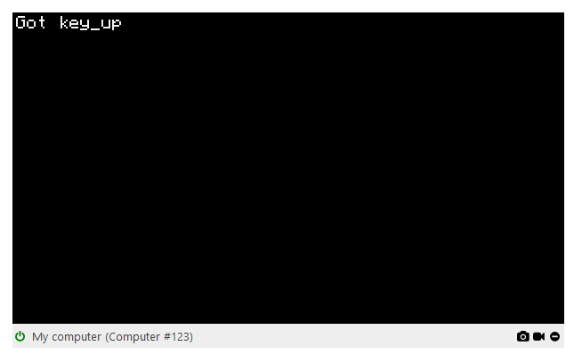

# cc-web-term

A simple library for web-based ComputerCraft terminals.

## Features

- Renders ComputerCraft terminal using a canvas.
- Bundles both the standard and "high definition" ComputerCraft fonts.
- Near-perfect event emulation.
- Gif recording and screenshot functionality

## Building

- `npm run prepack` will build the appropriate files.
- `npm run rollup && npm run host` will build the example, and host it at
  `http://localhost:8080/example`.

## Usage

See the `example/main.tsx` file for a basic example. When distributing, you
should bundle the contents of the `assets` folder, as we depend on all files in
there.

See [copy-cat] and [cloud-catcher] for more complex (and complete) examples.

[copy-cat]: https://github.com/SquidDev-CC/copy-cat
[cloud-catcher]: https://github.com/SquidDev-CC/cloud-catcher
